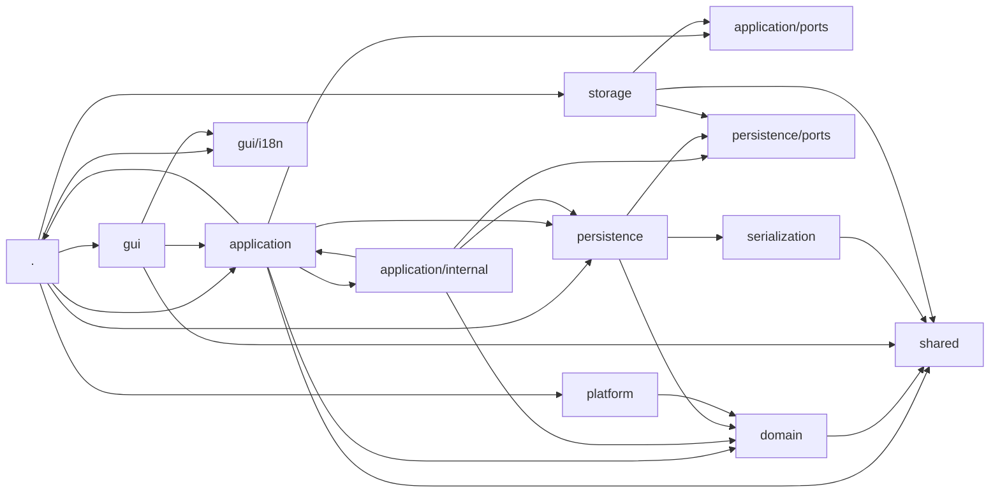
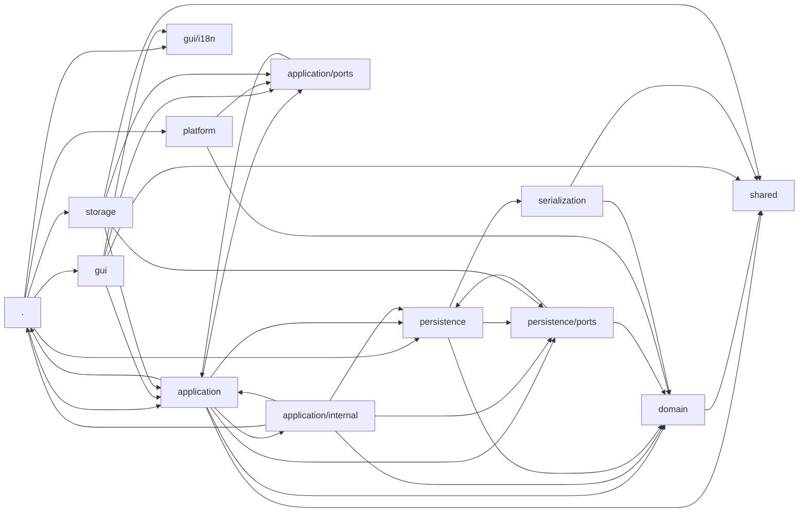

# Modulübersicht

Zur übrigen Projektdokumentation führt die [Projektübersicht](../../README.md).

## 1. Übersicht

Das Projekt implementiert den fachlichen Kern und die mobile React-Oberfläche
eines Social-Deduction-Spiels. Der Quellcode folgt einer Schichtenarchitektur:

| Bereich | Aufgabe |
| --- | --- |
| `src/shared` | Kleine, reine und fachlich neutrale Hilfsfunktionen |
| `src/domain` | Fachmodell, Invarianten und Spiellogik |
| `src/serialization` | JSON-Kodierung, Dokumentformate, Parsing und strukturelle Reparatur |
| `src/persistence` | Technische Orchestrierung von Laden, Speichern, Import, Export und Recovery |
| `src/application` | Anwendungsfälle, Präsentationsmodelle und anwendungsnahe Ports |
| `src/storage` | Browser-, Capacitor- und Entwicklungsadapter für Daten, Bilder und Einstellungen |
| `src/platform` | Weitere Browser- und Capacitor-Adapter für Geräte- und Systemfunktionen |
| `src/gui` | React-Oberfläche und Internationalisierung |
| `src/bootstrapApplication.tsx` | Composition Root und testbare Startorchestrierung |
| `src/main.tsx` | Minimaler technischer Einstiegspunkt der React-App |

Es gibt keine zentrale Barrel-Datei. Verbraucher importieren Funktionen und
Typen direkt aus dem jeweils verantwortlichen Modul. Die Architekturgrenzen
werden durch `tests/architectureBoundaries.test.ts` und
`tests/applicationContracts.test.ts` geprüft.

### 1.1 Funktionsabhängigkeiten

Das Diagramm aus `graph_SDG_functions.mmd` zeigt schichtübergreifende
Funktionsaufrufe. `.` steht für Module direkt unter `src/`.



### 1.2 Importabhängigkeiten

Das Diagramm aus `graph_SDG_imports.mmd` zeigt die statischen Importe zwischen
den Verzeichnissen. Ein Pfeil `A → B` bedeutet, dass Module aus `A` Module
aus `B` importieren.



### 1.3 Module direkt unter `src/`

- `bootstrapApplication.tsx` ist der Composition Root und enthält die testbare
  Startorchestrierung. Nur hier werden GUI, Application-Services, Persistenz,
  Storage- und Plattformadapter gemeinsam verdrahtet.
- `main.tsx` ist der minimale Einstiegspunkt und startet ausschließlich
  `bootstrapApplication`.
- `config.ts` enthält die globale Anwendungskonfiguration, unter anderem die
  aktive Sprache.
- `buildFlags.d.ts` deklariert die vom Build bereitgestellten Flags.

## 2. `src/application`

Die Application-Schicht stellt die betriebssystemunabhängigen Anwendungsfälle
für GUI und Composition Root bereit. Sie koordiniert Domain und Persistenz,
übersetzt technische Ergebnisse in anwendungsnahe Entscheidungen und erzeugt
Präsentationsmodelle. Sie greift nicht direkt auf Browser-, Capacitor- oder
GUI-Code zu.

Wichtige Modulgruppen:

- **Use-Case-Fassaden und Verträge:** `gameUseCases.ts`,
  `gameUseCaseContracts.ts`, `libraryUseCases.ts` und
  `libraryUseCaseContracts.ts` bilden die stabilen öffentlichen Zugänge für
  Spielstände und Szenariobibliotheken.
- **Spielvorbereitung und laufendes Spiel:** `gamePreparationService.ts`,
  `gamePreparationPresentation.ts`, `gameScreenPresentation.ts`,
  `gameTypes.ts`, `playerOverview.ts` und `rolesForShowing.ts`.
- **Szenarien und Regelwerke:** `scenarioEditor.ts`,
  `scenarioPresentation.ts` und `ruleSetExportService.ts`.
- **Fehler, Erfolge und Entscheidungen:** `applicationError.ts`,
  `applicationDecision.ts`, `objectSuccess.ts`, `objectList.ts`,
  `objectReadProblemService.ts`, `loadProblemQueue.ts`,
  `loadProblemResolutionService.ts`, `storageRecovery.ts` und
  `exportTypes.ts`.
- **Geräteunabhängige Dienste:** `settingsService.ts`, `appSettings.ts`,
  `appearanceService.ts`, `motionPreferenceService.ts`,
  `imageResourceService.ts` und `persistenceActivityService.ts`.

### 2.1 `src/application/internal`

Dieses Unterverzeichnis enthält konkrete Implementierungen und Verdrahtung,
die nicht Teil des öffentlichen Application-Vertrags sind. Andere Schichten
dürfen diese Module nicht direkt importieren.

- `createGameUseCases.ts` und `createLibraryUseCases.ts` bauen die öffentlichen
  Use-Case-Sammlungen auf; `bindMethods.ts` bindet die Service-Methoden.
- Die `defaultGame*Service.ts`-Module implementieren Import, Laden, Verwaltung,
  Recovery, Speichern, Sitzung und Vorlagenerzeugung.
- Die `defaultLibrary*Service.ts`-Module implementieren Backup, Durchsuchen und
  Recovery der Szenariobibliothek.
- `defaultScenarioImportService.ts`, `defaultScenarioManagementService.ts` und
  `defaultObjectReadProblemService.ts` bearbeiten Szenarien und Leseprobleme.
- `loadedGameSession.ts`, `pendingGameSaveWorkflow.ts`, `gameCatalog.ts`,
  `persistenceOperationRegistry.ts` und `writeRecoveryCoordinator.ts` halten
  internen Zustand und koordinieren längere Abläufe.
- `applicationObjectWriter.ts`, `applicationObjectListMapper.ts`,
  `applicationErrorMapping.ts`, `exportResultMapping.ts` und
  `libraryRepairPresentation.ts` übersetzen zwischen Persistence-, Domain- und
  Application-Modellen.

### 2.2 `src/application/ports`

Die Ports beschreiben technische Fähigkeiten, welche die Application benötigt,
ohne deren Plattformimplementierung zu kennen:

- `settingsStorage.ts`, `imageResourceStorage.ts` und
  `systemLanguagePort.ts` abstrahieren Einstellungen, Bildressourcen und
  Systemsprache.
- `systemThemePort.ts` und `motionPreferencePort.ts` abstrahieren
  Darstellungspräferenzen.
- `applicationLifecyclePort.ts`, `hapticFeedbackPort.ts`,
  `screenOrientationPort.ts` und `screenWakeLockPort.ts` abstrahieren
  Gerätefunktionen.

## 3. `src/domain`

Die Domain enthält das fachliche Modell und die reine Spiellogik. Sie kennt
weder Persistenz und Dokumentformate noch GUI oder Plattformadapter. Außerhalb
der Domain importiert sie nur neutrale Hilfen aus `shared`.

Wichtige Modulgruppen:

- **Kernmodell:** `models.ts`, `gameState.ts`, `gameDraft.ts`, `ruleSet.ts`,
  `statusDefinition.ts`, `playerStatus.ts`, `instant.ts` und `color.ts`.
- **Erzeugung und Validierung:** `gameFactory.ts`, `gameValidation.ts`,
  `ruleSetValidation.ts`, `templateFactory.ts` und `domainFailure.ts`.
- **Spielablauf:** `gameProgression.ts`, `playerActions.ts`,
  `roleDistribution.ts`, `seatOrder.ts`, `gameEditing.ts`,
  `sessionEditing.ts`, `gameRolesForShowing.ts`, `statusDefinitions.ts` und
  `roleStatusDefinitions.ts`.
- **Identitäten und Namen:** `gameEntityIds.ts`, `reservedIds.ts`,
  `stringSanitizer.ts`, `localizedNames.ts`, `scenarioRenaming.ts`,
  `unicodeSymbol.ts` und `unknownTeam.ts`.
- **Reparatur:** `gameRepair.ts`, `gameIdRepair.ts`,
  `gameEntityIdRepair.ts`, `gameReferenceRepair.ts`, `ruleSetRepair.ts`,
  `statusDefinitionRepair.ts` und `libraryContainerRepair.ts` stellen
  fachliche Invarianten beschädigter oder älterer Daten wieder her.
- **Injizierte technische Grunddienste:** `clock.ts` und `idGenerator.ts`
  definieren Verträge für Zeit und IDs; `domainServices.ts` verwaltet deren
  Domain-seitige Verwendung.

## 4. `src/gui`

Die GUI ist eine React-19-Oberfläche. Schichtübergreifend importiert sie nur
öffentliche Application-Module und fachlich neutrale Hilfen aus `shared`;
Domain, Persistence, Storage und Platform bleiben hinter den
Application-Verträgen verborgen.

- `App.tsx` steuert die oberste Navigation und verbindet die Bildschirme.
- `NewGameScreen.tsx`, `LoadGameScreen.tsx`, `GameScreen.tsx`,
  `ScenarioLibrary.tsx`, `RoleDistributionFlow.tsx`,
  `RolesForShowingScreen.tsx` und `SettingsScreen.tsx` bilden die
  Hauptarbeitsbereiche.
- `ModalDialog.tsx`, `LoadProblemDialogs.tsx`, `ColorField.tsx`,
  `TechnicalErrorDetails.tsx` und `ApplicationErrorBoundary.tsx` sind
  wiederverwendbare oder querschnittliche UI-Bausteine.
- `backNavigation.tsx` bündelt die Zurück-Navigation.
- `applicationFailurePresentation.ts`, `applicationSuccessPresentation.ts`,
  `libraryRepairPresentation.ts` und `playerActionWarningPresentation.ts`
  übersetzen Application-Ergebnisse in sichtbare Texte und Dialoginhalte.
- `app.css` enthält das globale Layout, Themes und die Komponentenstile.

### 4.1 `src/gui/i18n`

Dieses Unterverzeichnis enthält die Internationalisierung der Oberfläche.

- `messages.ts` definiert den vollständigen, typisierten Nachrichtenkatalog.
- `translate.ts` stellt Übersetzungs- und Interpolationsfunktionen bereit.
- `pluralRules.ts` kapselt die sprachabhängige Pluralauswahl.
- `registry.ts` registriert und lädt die verfügbaren Sprachmodule.
- Die übrigen Dateien sind Locale-Module. Ihr Dateiname entspricht dem
  Sprach- beziehungsweise Gebietscode, beispielsweise `de.ts`, `de-AT.ts`,
  `en.ts`, `en-GB.ts`, `ar-EG.ts`, `iu-Cans.ts` oder `zh.ts`. Jedes Modul
  liefert denselben durch `messages.ts` vorgegebenen Nachrichtenvertrag.

## 5. `src/persistence`

Persistence bildet die technische Objektgrenze zwischen Application,
Serialization und byteorientiertem Storage. Die Schicht orchestriert
Dateioperationen, kennt aber keine konkreten Browser- oder Capacitor-APIs.

- `objectPersistence.ts` bildet die gemeinsame Fassade; die spezialisierten
  Abläufe liegen in `objectReadPersistence.ts`, `objectWritePersistence.ts`,
  `objectTransferPersistence.ts` und `objectRecoveryPersistence.ts`.
- `gameObjectPersistence.ts` und `ruleSetObjectPersistence.ts` verbinden die
  generischen Abläufe mit den jeweiligen Dokumentformaten.
- `objectSaveWorkflow.ts` koordiniert sicheres Schreiben;
  `objectSaveInterruptedError.ts` beschreibt unterbrochene Schreibvorgänge.
- `trackedDataFileStorage.ts` verfolgt Storage-Aktivität und laufende Befehle.
- `internalDocumentFileName.ts` und `internalDataFileNameRepair.ts` erzeugen und
  reparieren interne Dateinamen.
- `objectPersistenceTypes.ts` und `objectPersistenceInternalTypes.ts` enthalten
  öffentliche beziehungsweise interne Datentypen.
- `objectPersistenceError.ts`, `serializationFailureTranslation.ts`,
  `storageFailureTranslation.ts` und `storageWriteErrorTranslation.ts`
  vereinheitlichen Fehler aus tieferen Schichten.

### 5.1 `src/persistence/ports`

Die Ports trennen die Persistenzlogik von konkreten Storage-Adaptern:

- `dataFileStorage.ts` und `dataFileTypes.ts` definieren den byteorientierten
  Dateispeicher und seine gemeinsamen Datentypen.
- `objectPersistenceCapabilities.ts` fasst die verfügbaren Objektoperationen
  zusammen.
- `objectReadPort.ts`, `objectWritePort.ts`, `objectTransferPort.ts` und
  `objectRecoveryPort.ts` teilen die Fähigkeiten nach Anwendungsfall auf.
- `storageCommand.ts`, `storageFailure.ts` und `storageRecovery.ts` modellieren
  Befehle, technische Fehler und Recovery-Kandidaten.

## 6. `src/platform`

Platform implementiert technische Ports außerhalb der Dateiablage. Die Module
konstruieren keine Application-Services; die Auswahl erfolgt in
`bootstrapApplication.tsx`.

- `systemClock.ts`, `systemIdGenerator.ts` und `systemLanguage.ts`
  implementieren Uhr, ID-Erzeugung und Erkennung der Systemsprache.
- `browserSystemThemeAdapter.ts`, `browserMotionPreferenceAdapter.ts`,
  `browserPreferenceAdapters.ts` und `mediaQueryChangeSubscription.ts` binden
  Browser-Media-Queries und Präferenzen an die Application-Ports an.
- `capacitorApplicationLifecycleAdapter.ts`,
  `capacitorHapticFeedbackAdapter.ts`,
  `capacitorScreenOrientationAdapter.ts` und
  `capacitorScreenWakeLockAdapter.ts` kapseln native Gerätefunktionen.
- `platformOperationError.ts` vereinheitlicht Fehler dieser Adapter.

## 7. `src/serialization`

Serialization ist plattformunabhängig und zuständig für JSON, Versionierung,
Dokumentstrukturen und strukturelle Reparatur. Die Schicht verwendet keine
Browser-, Node-, Storage- oder Capacitor-APIs.

- `gameDocument.ts`, `ruleSetDocument.ts`, `libraryDocument.ts` und
  `scenarioDocument.ts` definieren und dekodieren persistierte Dokumente.
- `gameDocumentFormat.ts` enthält Dateitypen und Schemaversionen.
- `gameExport.ts`, `ruleSetExport.ts` und `librarySerializer.ts` erzeugen
  externe beziehungsweise interne JSON-Darstellungen.
- `jsonEncoding.ts` übernimmt deterministische Kodierung;
  `jsonSyntaxError.ts` beschreibt Syntaxfehler.
- `jsonRepair.ts` und `libraryRepair.ts` führen strukturelle Reparaturen vor der
  fachlichen Validierung aus.
- `serializationFailure.ts` bildet die gemeinsame Fehlerhierarchie.

## 8. `src/shared`

`shared` ist die unterste, von allen Schichten nutzbare Basis. Das Verzeichnis
importiert keine andere Projektschicht.

- `textSanitizer.ts` normalisiert Text und bereits geparste Werte, ohne
  fachliche Annahmen zu treffen.

## 9. `src/storage`

Storage enthält konkrete Adapter. Für Datendateien implementieren sie die
Ports aus `persistence/ports`; Bild- und Einstellungsadapter implementieren die
anwendungsnahen Ports aus `application/ports`.

- `browserDataFileStorage.ts`, `browserImageResourceStorage.ts` und
  `browserSettingsStorage.ts` stellen die Browser- und Entwicklungsserver-
  Implementierungen bereit.
- `capacitorDataFileStorage.ts`, `capacitorImageResourceStorage.ts` und
  `capacitorSettingsStorage.ts` kapseln die native Android-/Capacitor-Ablage.
- `dataFileStorage.dev.ts`, `fileByteStorage.dev.ts` und
  `imageResourceStorage.dev.ts` dienen der lokalen Entwicklung und
  dateibasierten Testumgebung.
- `internalStorageCommandQueue.ts` serialisiert konkurrierende interne
  Storage-Befehle.
- `storageError.ts` enthält adapterspezifische Fehler und deren Einordnung.

## 10. Zentrale Verträge und Datenflüsse

### 10.1 Fachmodell und Änderungen

`GameState` ist der vollständige, validierte Zustand einer laufenden oder
gespeicherten Partie. `GameDraft` bildet dagegen noch nicht validierte Daten
aus Dokumenten ab. Dieser Unterschied ist beabsichtigt: Serialization erzeugt
zunächst einen Draft, Reparatur und Validierung überführen ihn anschließend in
das Fachmodell.

Die zentralen Entitäten sind `Team`, `Role` und `Player`. Fachliche Änderungen
laufen über Funktionen aus `domain` und nicht über direkte Objektänderungen in
GUI oder Adaptern. Die Domain darf dabei neue Zustände zurückgeben oder
kontrolliert bestehende Aggregate ändern; der jeweilige Vertrag ist am Typ und
an den Tests des Moduls erkennbar.

IDs sind stabile technische Identitäten. Reservierte IDs wie `t_unknown` und
`p_empty` haben eine feste Bedeutung. Lesbare Namen, Übersetzungen und
Dateinamen sind davon getrennt und dürfen nicht als Referenzschlüssel verwendet
werden.

### 10.2 Anwendungsfälle und Präsentationsmodelle

Die GUI arbeitet mit den öffentlichen Sammlungen `GameUseCases` und
`LibraryUseCases`. Ihre Teilservices trennen Sitzungsverwaltung, Persistenz,
Szenarioverwaltung, Import, Backup und Recovery. Konkrete Default-Services aus
`application/internal` werden ausschließlich im Composition Root erzeugt.

Präsentationsmodule bereiten fachliche Daten für die Oberfläche auf. Sie
enthalten keine React-Komponenten und führen keine Datei- oder Gerätezugriffe
aus. Umgekehrt rekonstruiert die GUI keine fachlichen Regeln aus Rohdaten,
sondern verwendet diese vorbereiteten Modelle und Application-Entscheidungen.

### 10.3 Laden, Reparieren und Speichern

Der reguläre Leseweg verläuft in dieser Reihenfolge:

```text
Storage-Adapter → Persistence → Serialization → Domain-Reparatur/Validierung
                → Application-Modell → GUI
```

Storage liefert Bytes und technische Fehler. Persistence koordiniert den
Vorgang und übersetzt Adapterfehler. Serialization prüft JSON-Syntax,
Dokumenttyp und Schemaversion. Erst danach stellt die Domain fachliche
Invarianten und Referenzen her. Die Application entscheidet, welche Probleme
automatisch behandelbar sind und welche Benutzerentscheidung erforderlich ist.

Beim Schreiben läuft der Datenfluss in Gegenrichtung. Externe Exporte und
interne Arbeitsdateien verwenden getrennte Operationen, auch wenn sie dieselben
Dokumenttypen serialisieren. Unterbrochene Schreibvorgänge bleiben als
Recovery-Fälle erkennbar; ein fehlgeschlagener Schreibvorgang darf nicht als
erfolgreich gemeldet werden.

### 10.4 Dokumentformate

Serialization besitzt die Hoheit über Dateityp, Schemaversion, JSON-Struktur
und deterministische Kodierung. Aktuelle Spiel- und Vorlagendokumente verwenden
die in `gameDocumentFormat.ts` definierten Typkennungen und Schemaversionen.
Neue Formatversionen benötigen Decoder-, Versions- und Roundtrip-Tests.

Importe dürfen fremde oder ältere Daten nicht direkt in Domain-Objekte casten.
Der vorgeschriebene Weg ist Parsen, strukturell prüfen beziehungsweise
reparieren, in einen Draft dekodieren und anschließend fachlich validieren.

### 10.5 Varianten der technischen Adapter

Browser-, Capacitor- und Entwicklungsadapter implementieren dieselben Ports,
können aber unterschiedliche Ablage- und Gerätefähigkeiten besitzen. Die
Auswahl einer Variante erfolgt ausschließlich in `bootstrapApplication.tsx`.
Dadurch bleiben Application und Domain unabhängig von der konkreten
Laufzeitumgebung.

## 11. Regeln für neue Module

Ein neues Modul gehört in die niedrigste Schicht, die alle benötigten
Abhängigkeiten bereits kennt. Fachliche Regeln gehören in `domain`,
Dokumentwissen in `serialization`, technische Dateiabläufe in `persistence`,
Anwendungsentscheidungen in `application` und sichtbare Interaktion in `gui`.

Neue technische Fähigkeiten werden als Port in der fachlich zuständigen
Schicht beschrieben und in `storage` oder `platform` implementiert. Nur
`bootstrapApplication.tsx` darf konkrete Implementierungen mit GUI und
Anwendungsfällen verdrahten. Änderungen an diesen Grenzen müssen durch die
Architekturtests abgesichert werden.

---

**Navigation:**
[Projektübersicht](../../README.md) | [Benutzerhandbuch](benutzerhandbuch.md) | [Entwicklerhandbuch](entwicklerhandbuch.md) | Modulübersicht
