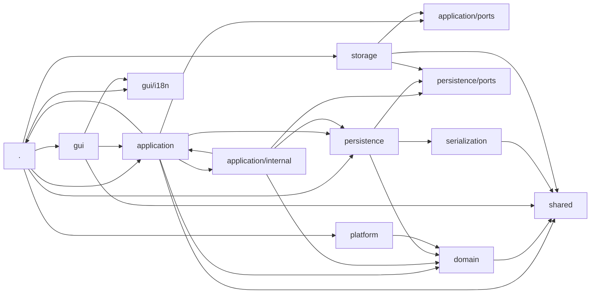
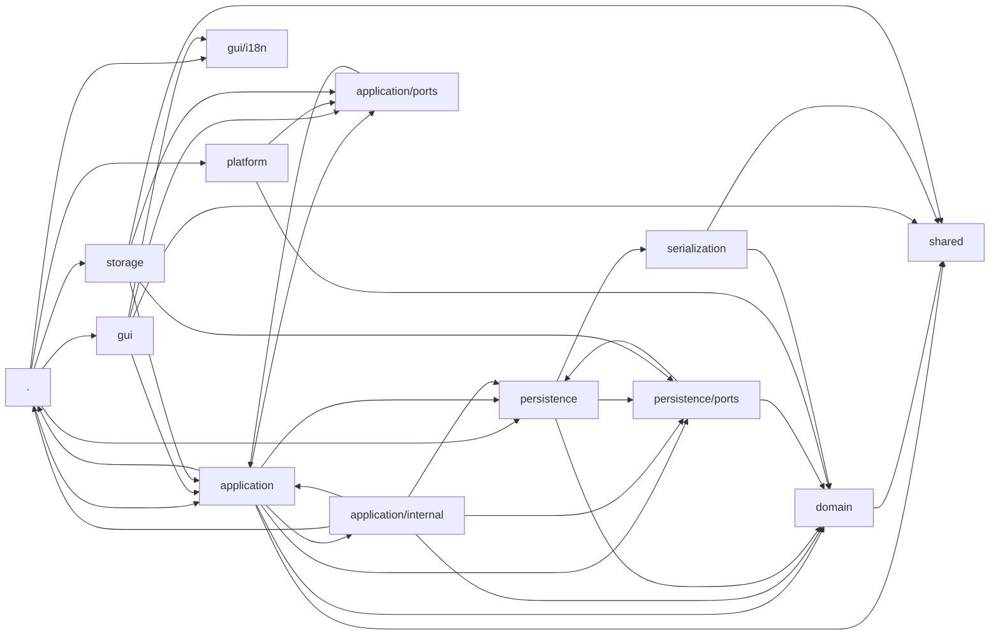

# Module Overview

For the rest of the project documentation, see the
[project overview](../../README.md).

## 1. Overview

The project implements the domain core and mobile React interface of a social
deduction game. The source code follows a layered architecture:

| Area | Responsibility |
| --- | --- |
| `src/shared` | Small, pure, domain-neutral helper functions |
| `src/domain` | Domain model, invariants, and game logic |
| `src/serialization` | JSON encoding, document formats, parsing, and structural repair |
| `src/persistence` | Technical orchestration of loading, saving, import, export, and recovery |
| `src/application` | Use cases, presentation models, and application-level ports |
| `src/storage` | Browser, Capacitor, and development adapters for data, images, and settings |
| `src/platform` | Other browser and Capacitor adapters for device and system functions |
| `src/gui` | React interface and internationalization |
| `src/bootstrapApplication.tsx` | Composition root and testable startup orchestration |
| `src/main.tsx` | Minimal technical entry point of the React app |

There is no central barrel file. Consumers import functions and types directly
from their responsible modules. Architecture boundaries are checked by
`tests/architectureBoundaries.test.ts` and
`tests/applicationContracts.test.ts`.

### 1.1 Function Dependencies

The diagram from `graph_SDG_functions.mmd` shows cross-layer function calls.
`.` represents modules directly under `src/`.



### 1.2 Import Dependencies

The diagram from `graph_SDG_imports.mmd` shows static imports between the
directories. An arrow `A → B` means that modules in `A` import modules from
`B`.



### 1.3 Modules Directly Under `src/`

- `bootstrapApplication.tsx` is the composition root and contains the testable
  startup orchestration. Only this module wires the GUI, Application services,
  Persistence, Storage, and Platform adapters together.
- `main.tsx` is the minimal entry point and only starts
  `bootstrapApplication`.
- `config.ts` contains global application configuration, including the active
  language.
- `buildFlags.d.ts` declares flags provided by the build.

## 2. `src/application`

The Application layer provides operating-system-independent use cases for the
GUI and composition root. It coordinates Domain and Persistence, translates
technical results into application-level decisions, and creates presentation
models. It does not access browser, Capacitor, or GUI code directly.

Important module groups:

- **Use-case facades and contracts:** `gameUseCases.ts`,
  `gameUseCaseContracts.ts`, `libraryUseCases.ts`, and
  `libraryUseCaseContracts.ts` form the stable public entry points for saved
  games and scenario libraries.
- **Game preparation and active game:** `gamePreparationService.ts`,
  `gamePreparationPresentation.ts`, `gameScreenPresentation.ts`,
  `gameTypes.ts`, `playerOverview.ts`, and `rolesForShowing.ts`.
- **Scenarios and rule sets:** `scenarioEditor.ts`,
  `scenarioPresentation.ts`, and `ruleSetExportService.ts`.
- **Errors, successes, and decisions:** `applicationError.ts`,
  `applicationDecision.ts`, `objectSuccess.ts`, `objectList.ts`,
  `objectReadProblemService.ts`, `loadProblemQueue.ts`,
  `loadProblemResolutionService.ts`, `storageRecovery.ts`, and
  `exportTypes.ts`.
- **Device-independent services:** `settingsService.ts`, `appSettings.ts`,
  `appearanceService.ts`, `motionPreferenceService.ts`,
  `imageResourceService.ts`, and `persistenceActivityService.ts`.

### 2.1 `src/application/internal`

This subdirectory contains concrete implementations and wiring that are not
part of the public Application contract. Other layers must not import these
modules directly.

- `createGameUseCases.ts` and `createLibraryUseCases.ts` build the public
  use-case collections; `bindMethods.ts` binds service methods.
- The `defaultGame*Service.ts` modules implement import, loading, management,
  recovery, saving, sessions, and template creation.
- The `defaultLibrary*Service.ts` modules implement backup, browsing, and
  recovery for the scenario library.
- `defaultScenarioImportService.ts`, `defaultScenarioManagementService.ts`, and
  `defaultObjectReadProblemService.ts` handle scenarios and read problems.
- `loadedGameSession.ts`, `pendingGameSaveWorkflow.ts`, `gameCatalog.ts`,
  `persistenceOperationRegistry.ts`, and `writeRecoveryCoordinator.ts` hold
  internal state and coordinate longer workflows.
- `applicationObjectWriter.ts`, `applicationObjectListMapper.ts`,
  `applicationErrorMapping.ts`, `exportResultMapping.ts`, and
  `libraryRepairPresentation.ts` translate between Persistence, Domain, and
  Application models.

### 2.2 `src/application/ports`

The ports describe technical capabilities required by Application without
knowing their platform implementations:

- `settingsStorage.ts`, `imageResourceStorage.ts`, and
  `systemLanguagePort.ts` abstract settings, image resources, and the system
  language.
- `systemThemePort.ts` and `motionPreferencePort.ts` abstract display
  preferences.
- `applicationLifecyclePort.ts`, `hapticFeedbackPort.ts`,
  `screenOrientationPort.ts`, and `screenWakeLockPort.ts` abstract device
  functions.

## 3. `src/domain`

Domain contains the domain model and pure game logic. It knows neither
Persistence and document formats nor GUI or Platform adapters. Outside Domain,
it imports only neutral helpers from `shared`.

Important module groups:

- **Core model:** `models.ts`, `gameState.ts`, `gameDraft.ts`, `ruleSet.ts`,
  `statusDefinition.ts`, `playerStatus.ts`, `instant.ts`, and `color.ts`.
- **Creation and validation:** `gameFactory.ts`, `gameValidation.ts`,
  `ruleSetValidation.ts`, `templateFactory.ts`, and `domainFailure.ts`.
- **Game flow:** `gameProgression.ts`, `playerActions.ts`,
  `roleDistribution.ts`, `seatOrder.ts`, `gameEditing.ts`,
  `sessionEditing.ts`, `gameRolesForShowing.ts`, `statusDefinitions.ts`, and
  `roleStatusDefinitions.ts`.
- **Identities and names:** `gameEntityIds.ts`, `reservedIds.ts`,
  `stringSanitizer.ts`, `localizedNames.ts`, `scenarioRenaming.ts`,
  `unicodeSymbol.ts`, and `unknownTeam.ts`.
- **Repair:** `gameRepair.ts`, `gameIdRepair.ts`,
  `gameEntityIdRepair.ts`, `gameReferenceRepair.ts`, `ruleSetRepair.ts`,
  `statusDefinitionRepair.ts`, and `libraryContainerRepair.ts` restore domain
  invariants in damaged or older data.
- **Injected fundamental technical services:** `clock.ts` and `idGenerator.ts`
  define contracts for time and IDs; `domainServices.ts` manages their use
  within Domain.

## 4. `src/gui`

The GUI is a React 19 interface. Across layer boundaries, it imports only
public Application modules and domain-neutral helpers from `shared`; Domain,
Persistence, Storage, and Platform remain hidden behind Application contracts.

- `App.tsx` controls top-level navigation and connects the screens.
- `NewGameScreen.tsx`, `LoadGameScreen.tsx`, `GameScreen.tsx`,
  `ScenarioLibrary.tsx`, `RoleDistributionFlow.tsx`,
  `RolesForShowingScreen.tsx`, and `SettingsScreen.tsx` form the main work
  areas.
- `ModalDialog.tsx`, `LoadProblemDialogs.tsx`, `ColorField.tsx`,
  `TechnicalErrorDetails.tsx`, and `ApplicationErrorBoundary.tsx` are reusable
  or cross-cutting UI components.
- `backNavigation.tsx` centralizes back navigation.
- `applicationFailurePresentation.ts`, `applicationSuccessPresentation.ts`,
  `libraryRepairPresentation.ts`, and `playerActionWarningPresentation.ts`
  translate Application results into visible text and dialog content.
- `app.css` contains the global layout, themes, and component styles.

### 4.1 `src/gui/i18n`

This subdirectory contains interface internationalization.

- `messages.ts` defines the complete typed message catalog.
- `translate.ts` provides translation and interpolation functions.
- `pluralRules.ts` encapsulates language-dependent plural selection.
- `registry.ts` registers and loads the available language modules.
- The remaining files are locale modules. Their file names correspond to the
  language or regional code, for example `de.ts`, `de-AT.ts`, `en.ts`,
  `en-GB.ts`, `ar-EG.ts`, `iu-Cans.ts`, or `zh.ts`. Every module supplies the
  same message contract defined by `messages.ts`.

## 5. `src/persistence`

Persistence forms the technical object boundary between Application,
Serialization, and byte-oriented Storage. The layer orchestrates file
operations but knows no concrete browser or Capacitor APIs.

- `objectPersistence.ts` provides the shared facade; specialized workflows
  reside in `objectReadPersistence.ts`, `objectWritePersistence.ts`,
  `objectTransferPersistence.ts`, and `objectRecoveryPersistence.ts`.
- `gameObjectPersistence.ts` and `ruleSetObjectPersistence.ts` connect the
  generic workflows to their respective document formats.
- `objectSaveWorkflow.ts` coordinates safe writes;
  `objectSaveInterruptedError.ts` describes interrupted write operations.
- `trackedDataFileStorage.ts` tracks Storage activity and active commands.
- `internalDocumentFileName.ts` and `internalDataFileNameRepair.ts` create and
  repair internal file names.
- `objectPersistenceTypes.ts` and `objectPersistenceInternalTypes.ts` contain
  public and internal data types, respectively.
- `objectPersistenceError.ts`, `serializationFailureTranslation.ts`,
  `storageFailureTranslation.ts`, and `storageWriteErrorTranslation.ts`
  normalize errors from lower layers.

### 5.1 `src/persistence/ports`

The ports separate Persistence logic from concrete Storage adapters:

- `dataFileStorage.ts` and `dataFileTypes.ts` define byte-oriented file storage
  and its shared data types.
- `objectPersistenceCapabilities.ts` combines the available object operations.
- `objectReadPort.ts`, `objectWritePort.ts`, `objectTransferPort.ts`, and
  `objectRecoveryPort.ts` divide capabilities by use case.
- `storageCommand.ts`, `storageFailure.ts`, and `storageRecovery.ts` model
  commands, technical failures, and recovery candidates.

## 6. `src/platform`

Platform implements technical ports outside file storage. Its modules do not
construct Application services; selection takes place in
`bootstrapApplication.tsx`.

- `systemClock.ts`, `systemIdGenerator.ts`, and `systemLanguage.ts` implement
  the clock, ID generation, and system-language detection.
- `browserSystemThemeAdapter.ts`, `browserMotionPreferenceAdapter.ts`,
  `browserPreferenceAdapters.ts`, and `mediaQueryChangeSubscription.ts` connect
  browser media queries and preferences to Application ports.
- `capacitorApplicationLifecycleAdapter.ts`,
  `capacitorHapticFeedbackAdapter.ts`,
  `capacitorScreenOrientationAdapter.ts`, and
  `capacitorScreenWakeLockAdapter.ts` encapsulate native device functions.
- `platformOperationError.ts` normalizes errors from these adapters.

## 7. `src/serialization`

Serialization is platform-independent and responsible for JSON, versioning,
document structures, and structural repair. The layer uses no browser, Node,
Storage, or Capacitor APIs.

- `gameDocument.ts`, `ruleSetDocument.ts`, `libraryDocument.ts`, and
  `scenarioDocument.ts` define and decode persisted documents.
- `gameDocumentFormat.ts` contains file types and schema versions.
- `gameExport.ts`, `ruleSetExport.ts`, and `librarySerializer.ts` create
  external and internal JSON representations.
- `jsonEncoding.ts` performs deterministic encoding; `jsonSyntaxError.ts`
  describes syntax errors.
- `jsonRepair.ts` and `libraryRepair.ts` perform structural repairs before
  domain validation.
- `serializationFailure.ts` forms the shared failure hierarchy.

## 8. `src/shared`

`shared` is the lowest-level foundation available to every layer. The
directory imports no other project layer.

- `textSanitizer.ts` normalizes text and already parsed values without making
  domain assumptions.

## 9. `src/storage`

Storage contains concrete adapters. Data-file adapters implement ports from
`persistence/ports`; image and settings adapters implement application-level
ports from `application/ports`.

- `browserDataFileStorage.ts`, `browserImageResourceStorage.ts`, and
  `browserSettingsStorage.ts` provide the browser and development-server
  implementations.
- `capacitorDataFileStorage.ts`, `capacitorImageResourceStorage.ts`, and
  `capacitorSettingsStorage.ts` encapsulate native Android/Capacitor storage.
- `dataFileStorage.dev.ts`, `fileByteStorage.dev.ts`, and
  `imageResourceStorage.dev.ts` support local development and the file-based
  test environment.
- `internalStorageCommandQueue.ts` serializes concurrent internal Storage
  commands.
- `storageError.ts` contains adapter-specific errors and their classification.

## 10. Central Contracts and Data Flows

### 10.1 Domain Model and Changes

`GameState` is the complete, validated state of an active or saved game.
`GameDraft`, by contrast, represents data from documents that has not yet been
validated. This distinction is intentional: Serialization first creates a
draft, after which repair and validation transform it into the domain model.

The central entities are `Team`, `Role`, and `Player`. Domain changes go
through functions from `domain`, not through direct object changes in GUI or
adapters. Domain may return new states or modify existing aggregates in a
controlled manner; the relevant contract is apparent from the module's types
and tests.

IDs are stable technical identities. Reserved IDs such as `t_unknown` and
`p_empty` have fixed meanings. Display names, translations, and file names are
kept separate and must not be used as reference keys.

### 10.2 Use Cases and Presentation Models

The GUI works with the public `GameUseCases` and `LibraryUseCases` collections.
Their subservices separate session management, Persistence, scenario
management, import, backup, and recovery. Concrete default services from
`application/internal` are created only in the composition root.

Presentation modules prepare domain data for the interface. They contain no
React components and perform no file or device access. Conversely, the GUI
does not reconstruct domain rules from raw data but uses these prepared models
and Application decisions.

### 10.3 Loading, Repairing, and Saving

The regular read path follows this order:

```text
Storage adapter → Persistence → Serialization → Domain repair/validation
                → Application model → GUI
```

Storage supplies bytes and technical failures. Persistence coordinates the
operation and translates adapter failures. Serialization checks JSON syntax,
document type, and schema version. Only then does Domain restore domain
invariants and references. Application decides which problems can be handled
automatically and which require a user decision.

Writing follows the reverse data flow. External exports and internal working
files use separate operations even when they serialize the same document
types. Interrupted write operations remain identifiable as recovery cases; a
failed write operation must not be reported as successful.

### 10.4 Document Formats

Serialization owns the file type, schema version, JSON structure, and
deterministic encoding. Current game and template documents use the type
identifiers and schema versions defined in `gameDocumentFormat.ts`. New format
versions require decoder, version, and round-trip tests.

Imports must not cast external or older data directly to Domain objects. The
required path is to parse, structurally check or repair, decode into a draft,
and then perform domain validation.

### 10.5 Technical Adapter Variants

Browser, Capacitor, and development adapters implement the same ports but may
offer different storage and device capabilities. A variant is selected only in
`bootstrapApplication.tsx`. This keeps Application and Domain independent of
the concrete runtime environment.

## 11. Rules for New Modules

A new module belongs in the lowest layer that already knows all required
dependencies. Domain rules belong in `domain`, document knowledge in
`serialization`, technical file workflows in `persistence`, application
decisions in `application`, and visible interaction in `gui`.

New technical capabilities are described as a port in the responsible layer
and implemented in `storage` or `platform`. Only `bootstrapApplication.tsx` may
wire concrete implementations to the GUI and use cases. Changes to these
boundaries must be enforced by architecture tests.

---

**Navigation:**
[Project overview](../../README.md) | [User Guide](user-guide.md) | [Developer Guide](developer-guide.md) | Module Overview
